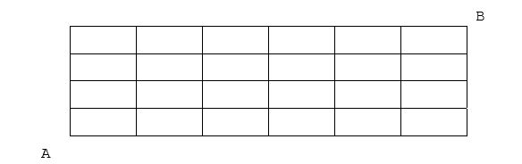
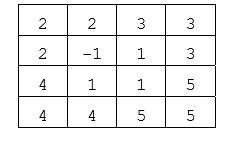

# 第十三届全国青少年信息学奥林匹克联赛初赛试题 
### 普及组  C++语言  二小时完成 ）  
● ●  全部试题答案均要求写在答卷纸上，写在试卷纸上一律无效  ●●  
  
## 一、 单项选择题 （共 20 题，每题 1.5 分，共计 30 分。每题有且仅有一个正确答案.） 。 
 
1. 在以下各项中，（）不是 CPU 的组成部分。   
	A. 控制器   
	B. 运算器   
	C. 寄存器   
	D. 主板     
2. 在关系数据库中，存放在数据库中的数据的逻辑结构以（）为主。   
	A. 二叉树   
	B. 多叉树   
	C. 哈希表   
	D. 二维表 
3. 在下列各项中，只有（）不是计算机存储容量的常用单位。   
	A. Byte   
	B. KB   
	C. UB   
	D. TB 
4. ASCII 码的含义是（）。   
	A. 二─十进制转换码   
	B. 美国信息交换标准代码   
	C. 数字的二进制编码   
	D. 计算机可处理字符的唯一编码   
5. 一个完整的计算机系统应包括（）。   
	A. 系统硬件和系统软件   
	B. 硬件系统和软件系统   
	C. 主机和外部设备   
	D. 主机、键盘、显示器和辅助存储器
6. IT 的含义是（）。   
	A. 通信技术   
	B. 信息技术   
	C. 网络技术   
	D. 信息学 
7. LAN 的含义是（）。   
	A. 因特网   
	B. 局域网   
	C. 广域网   
	D. 城域网 
8. 冗余数据是指可以由其他数据导出的数据，例如，数据库中已存放了学生的数学、语文和英语的三 科成绩，如果还存放三科成绩的总分，则总分就可以看作冗余数据。冗余数据往往会造成数据的不一致， 例如，上面 4个数据如果都是输入的，由于操作错误使总分不等于三科成绩之和，就会产生矛盾。下面 关于冗余数据的说法中，正确的是（）。   
	A. 应该在数据库中消除一切冗余数据   
	B. 用高级语言编写的数据处理系统，通常比用关系数据库编写的系统更容易消除冗余数据。   
	C. 为了提高查询效率，在数据库中可以适当保留一些冗余数据，但更新时要做相容性检验   
	D. 做相容性检验会降低效率，可以不理睬数据库中的冗余数据 
9. 在下列各软件中，不属于 NOIP 竞赛（复赛）推荐使用的语言环境有（）。   
	A. gcc   
	B. g++   
	C. Turbo C   
	D. free pascal   
10. 以下断电之后仍能保存数据的有（）。   
	A. 硬盘   
	B. 高速缓存   
	C. 显存   
	D. RAM   
11. 在下列关于计算机语言的说法中，正确的有（）。   
	A. 高级语言比汇编语言更高级，是因为它的程序的运行效率更高   
	B. 随着Pascal、C等高级语言的出现，机器语言和汇编语言已经退出了历史舞台   
	C. 高级语言程序比汇编语言程序更容易从一种计算机移植到另一种计算机上   
	D. C是一种面向对象的高级计算机语言 
12. 近20年来，许多计算机专家都大力推崇递归算法，认为它是解决较复杂问题的强有力的工具。在下 列关于递归算法的说法中，正确的是（）。   
	A. 在1977年前后形成标准的计算机高级语言“FORTRAN77”禁止在程序使用递归，原因之一是该方 法可能会占用更多的内存空间   
	B. 和非递归算法相比，解决同一个问题，递归算法一般运行得更快一些   
	C. 对于较复杂的问题，用递归方式编程一般比非递归方式更难一些   
	D. 对于已经定义好的标准数学函数 sin(x)，应用程序中的语句“y=sin(sin(x));”就是一种递归调用
13. 一个无法靠自身的控制终止的循环称为“死循环”，例如，在 C++语言程序中，语句“while(1) printf(“*”);”就是一个死循环，运行时它将无休止地打印*号。下面关于死循环的说法中，只有（）是正确的。   
	 A. 不存在一种算法，对任何一个程序及相应的输入数据，都可以判断是否会出现死循环，因而， 任何编译系统都不做死循环检验   
	B．有些编译系统可以检测出死循环   
	C. 死循环属于语法错误，既然编译系统能检查各种语法错误，当然也应该能检查出死循环   
	D. 死循环与多进程中出现的“死锁”差不多，而死锁是可以检测的，因而，死循环也可以检测的 
14. 在 C++程序中，表达式23|2^5的值是（）   
	A. 23   
	B. 1   
	C. 32   
	D. 18   
15. 在 C++程序中，判断 a等于 0或b等于 0或c等于 0的正确的条件表达式是（）   
	A. !((a!=0)||(b!=0)||(c!=0))   
	B. !((a!=0)&&(b!=0)&&(c!=0))   
	C. !(a==0&&b==0)||(c!=0)   
	D. (a=0)&&(b=0)&&(c=0) 
16. 地面上有标号为 A、B、C的3根细柱，在 A柱上放有 10 个直径相同中间有孔的圆盘，从上到下 依次编号为 1，2，3，……，将 A 柱上的部分盘子经过 B 柱移入 C 柱，也可以在 B 柱上暂存。如果 B 柱上的操作记录为：“进，进，出，进，进，出，出，进，进，出，进，出，出”。那么，在 C柱上，从 下到上的盘子的编号为（）。   
	A. 2 4 3 6 5 7   
	B. 2 4 1 2 5 7   
	C. 2 4 3 1 7 6   
	D. 2 4 3 6 7 5   
17. 与十进制数 1770 对应的八进制数是（）。   
	A. 3350   B. 3351   
	C. 3352   
	D. 3540   
18. 设A=B=true，C=D=false，以下逻辑运算表达式值为假的有（）。
	A. (¬A∧B)∨(C∧D∨A)   
	B. ¬(((A∧B)∨C)∧D)   
	C. A∧(B∨C∨D)∨D   
	D. (A∧(D∨C)) ∧B  
19. (2070)16 + (34)8的结果是（）。   
	A. (8332)10   
	B. (208A)8   
	C. (100000000110)2  
	D. (20212)8 
20. 已知 7个结点的二叉树的先根遍历是 1 2 4 5 6 3 7（数字为结点的编号，以下同），中根遍历 是4 2 6 5 1 7 3，则该二叉树的后根遍历是（）   
	A. 4 6 5 2 7 3 1   
	B. 4 6 5 2 1 3 7   
	C. 4 2 3 1 5 4 7   
	D. 4 6 5 3 1 7 2   

## 二、 问题求解（共 2题，每题 5分，共计 10 分）   
1. （子集划分）将n个数{1，2，…，n}划分成r个子集。每个数都恰好属于一个子集，任何两个不同的子集没有共同的数，也没有空集。将不同划分方法的总数记为S(n,r)。例如，S(4,2)=7，这7种不同的划分方法依{(1),(234)},{(2),(134)},{(3),(124)},{(4),(123)},{(12),(34)},{(13),(24)}, {(14),(23)}。当n=6,r=3时，S(6,3)= _____________。   
	（提示：先固定一个数，对于其余的 5个数考虑 S(5,3)与 S(5,2)，再分这两种情况对原固定的数 进行分析）。   
2. （最短路线）某城市 的街道是一个很规整的矩形网格（见下图），有 7条南北向的纵街，5条东 西向的横街。现要从西南角的 A走到东北角的 B，最短的走法共有多少种？_________________.   
	   

## 三、 阅读程序写结果（共 4题，每题 8分，共计 32 分）   
1. 　
	~~~
	#include <iostream.h>
	void main() 
	{int i,p[5],a,b,c,x,y=20;
	for(i=0;i<=4;i++)cin>>p[i];
	a=(p[0]+p[1])+(p[2]+p[3]+p[4])/7;
	b=p[0]+p[1]/((p[2]+p[3])/p[4]);
	c=p[0]*p[1]/p[2]; 
	x=a+b-p[(p[3]+3)%4];
	if(x>10)
	y+=(b*100-a)/(p[p[4]%3]*5);
	else
	y+=20+(b*100-c)/(p[p[4]%3]*5);  
	cout<<x<<","<<y<<endl; }
	~~~
// 注：本例中，给定的输入数据可以避免分母为 0或数组元素下标越界。   
输入：6 6 5 5 3   
输出：_______________   
2. 　
	~~~
	
	#include <iostream.h>
	void fun(int *a,int *b) 
	{
		int *k; 
		k=a; a=b; b=k;
	} 
	void main()
		{
			int a=3, b=6, *x=&a, *y=&b;
			fun(x,y);  
			cout<<a<<","<<b<<endl;
		}
	~~~
	输出:____________________   
3. 　
	~~~
	#include <iostream.h> 
	#include <iomanip.h> 
	#include "math.h" 
	void main() 
	{
		int a1[51]={0};
		int i,j,t,t2,n=50;  
		for(i=2;i<=sqrt(n);i++)  
			if(a1[i]==0)
			{
				t2=n/i;  
				for(j=2;j<=t2;j++)
				a1[i*j]=1;
			}  
		t=0;
		for(i=2;i<=n;i++) 
			if(a1[i]==0)
			{
				cout<<setw(4)<<i;  
				t++;  
				if(t%10==0) 
					cout<<endl;
			}
		cout<<endl;
	} 
	~~~
	输出：________________________________________
		 ________________________________________ 
4. 　
	~~~
	#include <iostream.h> 
	#include "ctype.h" 
	void expand(char s1[],char s2[]) 
	{
		int i,j,a,b,c;
		j=0;
		for(i=0;(c=s1[i])!='\0';i++)
		if(c=='-')
		{
			a=s1[i-1];
			b=s1[i+1];
			if ( isalpha(a)&&isalpha(b) || isdigit(a)&&isdigit(b) )
			//函数 isalpha(a)用于判断字符 a是否为字母，isdigit(b) 用于判断字符 b是否为数 
			//字，如果是，返回 1，否则返回 0 
			{
				j--; 
				do  
				s2[j++]=a++;
				while(tolower(a)<tolower(s1[i+1]));
			}   
			else 
				s2[j++]=c;
		}   
		else 
			s2[j++]=c;   
		s2[j]='\0';
	}
	void main()
	{
		char s1[100],s2[300];
		cin>>s1;
		expand(s1,s2);
		cout<<s2<<endl; 
	}
	~~~ 
	输入：wer2345d-h454-82qqq   
	输出：____________________________________ 
## 四．完善程序 (前4空，每空 2.5 分，后 6空，每空 3分，共 28 分) 
 
1. 　（求字符串的逆序）下面的程序的功能是输入若干行字符串，每输入一行，就按逆序输出该行，最后 键入-1 终止程序。 请将程序补充完整。   

	~~~
	#include <iostream.h>
	#include <string.h> 
	int maxline=200,kz; 
	int reverse(char s[])  
	{
	int i,j,t;
	for(i=0,j=strlen(s)-1; i<j;___①___，___②___)
		{t=s[i]; s[i]=s[j]; s[j]=t;}
	return 0;
	}
	void main()
	{
		char line[100];
		cout<<"continue? -1 for end."<<endl;
		cin>>kz;
	while(___③___)
	{
		cin>>line;
		___④___;
		cout<<line<<endl; 
		cout<<"continue? -1 for end."<<endl;
		cin>>kz;
	} 
	~~~
2. 　（棋盘覆盖问题）在一个 k k 22 × 个方格组成的棋盘中恰有一个方格与其他方格不同（图中标记为-1的方格），称之为特殊方格。现用L型（占3个小格）纸片覆盖棋盘上除特殊方格的所有部分，各纸 片不得重叠，于是，用到的纸片数恰好是（4k-1）/3。在下表给出的一个覆盖方案中，k=2，相同的 3 个数字构成一个纸片。   
	下面给出的程序是用分治法设计的，将棋盘一分为四，依次处理左上角、右上角、左下角、右下角， 递归进行。请将程序补充完整。 2 2 3 3 2 -1 1 3 4 1 1 5 4 4 5 5   

	~~~
	#include <iostream.h>
	#include <iomanip.h> 
	int board[65][65],tile;
	// tile 为纸片编号 
	void chessboard(int tr,int tc,int dr,int dc,int size) 
	// dr,dc 依次为特殊方格的行、列号  
	{
	int t,s;  
	if (size==1)
		___⑤___;  
		t=tile++;  
		s=size/2;  
	if(___⑥___)   
		chessboard(tr,tc,dr,dc,s);  
	else   
	{
		board[tr+s-1][tc+s-1]=t;
		___⑦___;   
	}  
	if(dr<tr+s && dc>=tc+s)   
		chessboard(tr,tc+s,dr,dc,s);  
	else   
	{
		board[tr+s-1][tc+s]=t;___⑧___;   
	}  
	if(dr>=tr+s && dc<tc+s)   
		chessboard(tr+s,tc,dr,dc,s);  
	else 
	{
		board[tr+s][tc+s-1]=t;___⑨___;   
	}  
	if(dr>=tr+s && dc>=tc+s)   
		chessboard(tr+s,tc+s,dr,dc,s);  
	else   
	{
		board[tr+s][tc+s]=t;
		___⑩___;   
	} 
	} 
	void prt1(int b[][65],int n) 
	{
		int i,j;  
		for(i=1;i<=n;i++)  
		{for(j=1;j<=n;j++)     
		cout<<setw(3)<<b[i][j];   
		cout<<endl;;  
	} 
	}  
	void main()  
	{
		int size,dr,dc;   
		cout<<"input size(4/8/16/64):"<<endl;   
		cin>>size;   
		cout<<"input the position of special block(x,y):"<<endl;   
		cin>>dr>>dc;   
		board[dr][dc]=-1;   
		tile++;   
		chessboard(1,1,dr,dc,size);   
		prt1(board,size); 
	} 
	~~~
